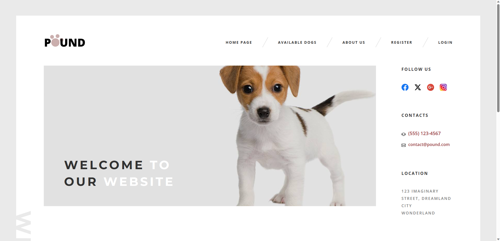
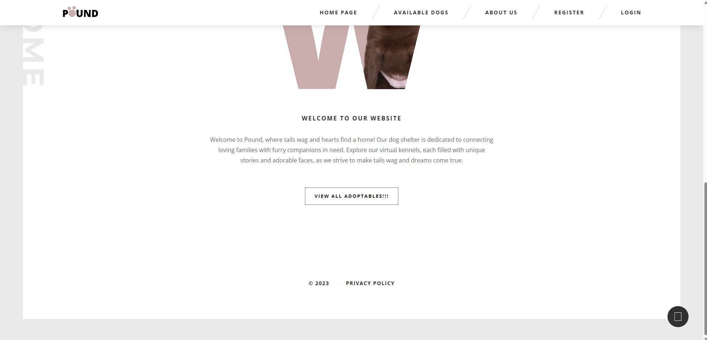
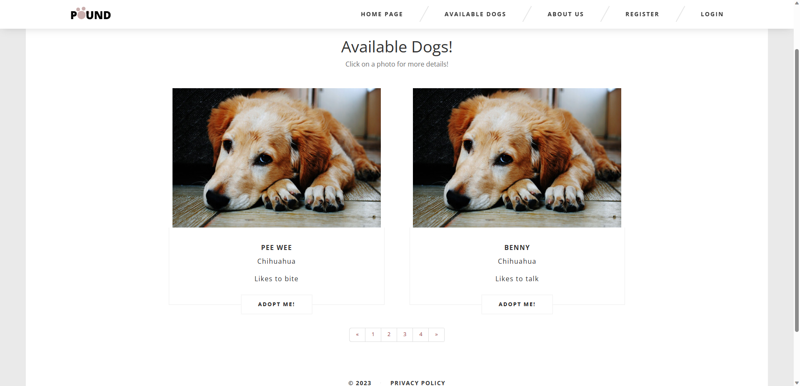
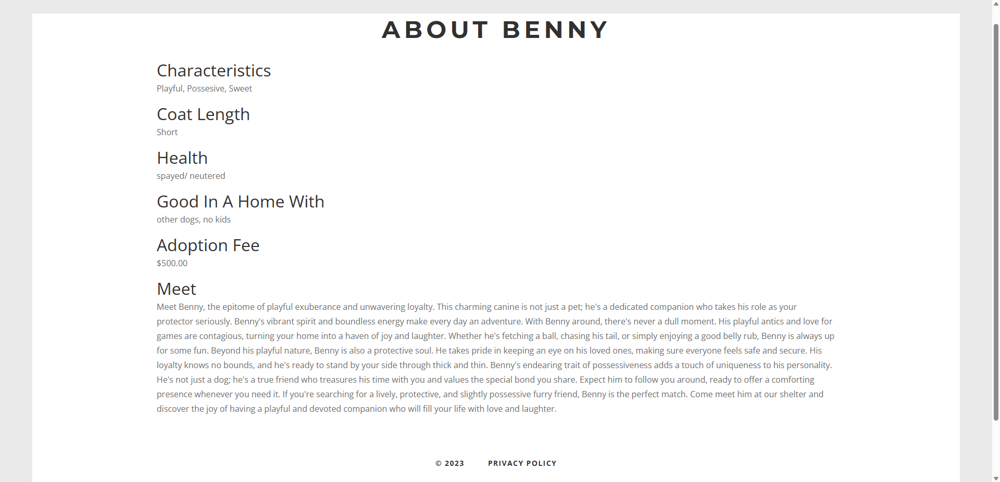

# Mock Rescue Dog Shelter Application

## Introduction
Welcome to the Mock Rescue Dog Shelter Application README.
This application is a fictional web-based platform designed
to help manage a rescue dog shelter. It allows users to view 
available dogs for adoption, submit adoption applications, 
and for administrators, provides CRUD (Create, Read, Update, Delete)
functionality to manage dog listings, applications, and user accounts.

[Check it out!](https://animalrescuewebsite.azurewebsites.net/)

## Authors
- Aaron Kornish

## Features
- User Authentication:
  - Users can create accounts and log in securely.
- User Features:
  - View a list of available dogs for adoption
  - Submit adoption applications
- Admin Features:
  - Log in as an admin to access the dashboard.
  - CRUD functionality for managing dog listings.

## Getting Started
Use code first migrations and update the database. Scripts have been provided to populate the dog table in the database.

### Notes:
The live website might take a while to load due to it being published with the free tier on Azure. If traffic is not consistent it could take a while to load.

